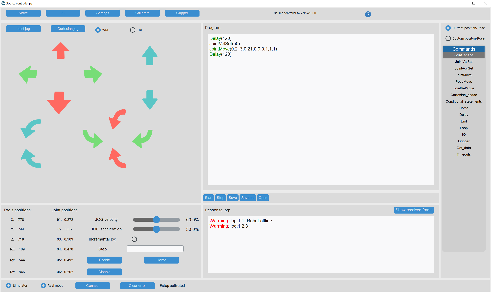

# PAROL-commander-software
    

https://source-robotics.com

To use commander software your PC needs to meet some [minimal hardware specs!](https://github.com/PCrnjak/PAROL-commander-software/blob/main/confirmed_working_systems.md)

Robot arm building instructions, STL files, BOM can be found here: [Link](https://github.com/PCrnjak/PAROL6-Desktop-robot-arm)

To run this code you need to use the PAROL6 control board! You can buy it here: [Link!](https://source-robotics.com/products/parol6-control-board)

PAROL6 commander software is a tool for controlling and programming the PAROL6 robotic arm!
Some of the features are:  
* Loop rates of up to 100Hz allowing for real-time control
* Joint jogging
* Cartesian level jogging in the world reference frame and tool reference frame
* Full telemetry data
* Error handling like Inverse kinematics errors, Joint position limits, speed limits, Estop...
* Response log 
* Built-in simulator
* Programming interface with simple-to-use commands
* Real-time control of robot outputs and reading of inputs
* Built-in control for [SSG-48 adaptive electric gripper](https://source-robotics.com/products/compliant-gripper)

# What is PAROL6 robotic arm?

PAROL6 is a high-performance 3D-printed desktop robotic arm. The design approach of PAROL6 was to be similar to industrial robots in terms of mechanical design, control software, and usability. Control software, GUI, and robots STL files are open-source. You can build your own PAROL6 robot by following the instructions on this [page](https://github.com/PCrnjak/PAROL6-Desktop-robot-arm/tree/main/Building%20instructions).

# Minimal hardware requirements

To run the PAROL6 robotic arm with commander software you will need to meet some minimal PC specifications.
Check already tested systems and compare them to your system: [Compare](https://github.com/PCrnjak/PAROL-commander-software/blob/main/confirmed_working_systems.md)

# How to install 

Tested on python 3.10.12  

**Manual** 
How to install on the Linux: [Link](https://github.com/PCrnjak/PAROL-commander-software/blob/main/Linux_install.md) 
How to install on Windows: [Link](https://github.com/PCrnjak/PAROL-commander-software/blob/main/Windows_install.md)
  **Also works on MAC, just follow the Linux install guide.

**Using requirements.txt** 
pip install -r requirements.txt

For Linux you will also have to: 
sudo apt-get install python3-tk 
sudo apt-get install python3-pil python3-pil.imagetk 

# Dependency

You can compare what Python modules are used on the systems that are proven to work! 
[Dependency](https://github.com/PCrnjak/PAROL-commander-software/tree/main/Working%20dependency)

# Documentation:

How to use PAROL commander software can be found in [DOCS](https://source-robotics.github.io/PAROL-docs/)

# More about PAROL6
Join [Discord](https://discord.com/invite/prjUvjmGpZ ) community!
- [Youtube](https://www.youtube.com/channel/UCp3sDRwVkbm7b2M-2qwf5aQ)
- [Hackaday](https://hackaday.io/project/167247-faze4-robotic-arm)
- [Instagram](https://www.instagram.com/source_robotics/)
- [DOCS](https://source-robotics.github.io/PAROL-docs/)

  
# 📢📢Contributing to the project 📢📢
Some features are still missing on the software and hardware side of the PAROL6. 
If you want to contribute to the project and don't know how you can help in the implementation of some of these features:

General features:
  - ROS2 support
  - Moveit example
  - ROBODK postprocessor
  - TODO -> Stepper driver stages need to go to short or all fets low when the power button is pressed
  - TODO ->Implement Swift simulator - https://github.com/jhavl/swift
  - TODO -> Create executable files for windows and Linux

  PAROL6 commander software features:
  - Reading GCODE commands
  - Reading inputs
  - implementing flow control
  - Graphical simulator?
  - Saving programs to the Control board Flash
  - Offline execution of the code (from the flash)
  - Blending in trajectory planner

# Liability 
1. The software is still in development and may contain bugs, errors, or incomplete features.
2. Users are encouraged to use this software responsibly and at their own risk.

# Support
This project is entirely open source and free for all to use. Any support, whether through donations or advice, is greatly appreciated. Thank you!

 

# Project is under GPLv3 Licence
